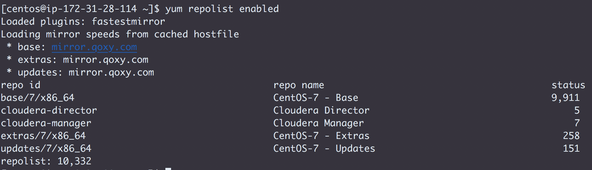
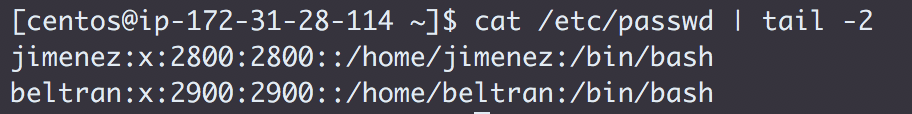
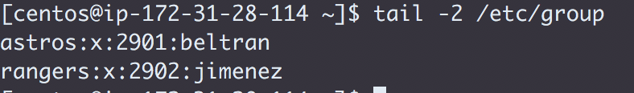

## <center> Challenge Setup

* In the file `challenges/labs/0_setup.md`:
  * List the cloud provider you are using       
  **AWS**
  * List your instances by IP address and DNS name (don't use `/etc/hosts` for this)
  ```
  172.31.28.114    ip-172-31-28-114.ap-southeast-1.compute.internal
  172.31.17.246    ip-172-31-17-246.ap-southeast-1.compute.internal
  172.31.24.192    ip-172-31-24-192.ap-southeast-1.compute.internal
  172.31.19.10    ip-172-31-19-10.ap-southeast-1.compute.internal
  172.31.29.13    ip-172-31-29-13.ap-southeast-1.compute.internal
  ```
  * List the Linux release you are using
  **Centos 7**
  * List the file system capacity for the first node
  ```
  [centos@ip-172-31-28-114 ~]$ df -h
  Filesystem      Size  Used Avail Use% Mounted on
  /dev/xvda1       50G  843M   50G   2% /
  devtmpfs        7.8G     0  7.8G   0% /dev
  tmpfs           7.8G     0  7.8G   0% /dev/shm
  tmpfs           7.8G   17M  7.8G   1% /run
  tmpfs           7.8G     0  7.8G   0% /sys/fs/cgroup
  tmpfs           1.6G     0  1.6G   0% /run/user/1000
  ```
  * List the command and output for `yum repolist enabled`
  
* Add the following Linux accounts to all nodes
  * User `jimenez` with a UID of `2800`
  
  * User `beltran` with a UID of `2900`
  
  * Create the group `astros` and add `beltran` to it
  
  * Create the group `rangers` and add `jimenez` to it
  
* List the `/etc/passwd` entries for `jimenez` and `beltran`
  * Do not list the entire file
  
* List the `/etc/group` entries for `astros` and `rangers`
  * Do not list the entire file
  
* Push these updates to GitHub
* Label your Issue `review`
* Assign the Issue to the instructor

---
<div style="page-break-after: always;"></div>
