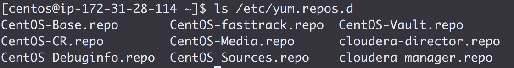

## <center> Challenge 2: Install Cloudera Manager

* Create the Issue `Install CM`
* Assign yourself and label it `started`
* Install Cloudera Manager on the second node listed in `0_setup.md`
* List the command and output for `ls /etc/yum.repos.d` in `challenges/labs/1_cm.md`
  
  * Copy `cloudera-manager.repo` to `challenges/labs/2_cloudera-manager.repo.md`
  ```
  [cloudera-manager]
# Packages for Cloudera Manager, Version 5, on RedHat or CentOS 7 x86_64
name=Cloudera Manager
baseurl=http://archive.cloudera.com/cm5/redhat/7/x86_64/cm/5.13.3/
gpgkey =https://archive.cloudera.com/cm5/redhat/7/x86_64/cm/RPM-GPG-KEY-cloudera
gpgcheck = 1
  ```
* Connect Cloudera Manager Server to its database
  * Use the `scm_prepare_database.sh` script to create the `db.properties` file
  * List the full command and its output in `2_properties.md`
  `sudo /usr/share/cmf/schema/scm_prepare_database.sh mysql -h localhost -uroot -pcdh1234 -P 3306 scm scm scm`
  * Add the `db.properties` file content to `2_properties.md`
  ```
  Client characterset:	utf8
# Auto-generated by scm_prepare_database.sh on Thu May 17 06:11:54 UTC 2018
#
# For information describing how to configure the Cloudera Manager Server
# to connect to databases, see the "Cloudera Manager Installation Guide."
#
com.cloudera.cmf.db.type=mysql
com.cloudera.cmf.db.host=localhost:3306
com.cloudera.cmf.db.name=scm
com.cloudera.cmf.db.user=scm
com.cloudera.cmf.db.setupType=EXTERNAL
com.cloudera.cmf.db.password=scm
  ```
* Start the Cloudera Manager server
`sudo service cloudera-scm-server start`
* In `challenges/labs/2_cm_startup.md` add:
  * The first line of the server log
  ```
  2018-05-17 06:08:04,131 INFO main:com.cloudera.server.cmf.Main: Starting SCM Server. JVM Args: [-Dlog4j.configuration=file:/etc/cloudera-scm-server/log4j.properties, -Dfile.encoding=UTF-8, -Dcmf.root.logger=INFO,LOGFILE, -Dcmf.log.dir=/var/log/cloudera-scm-server, -Dcmf.log.file=cloudera-scm-server.log, -Dcmf.jetty.threshhold=WARN, -Dcmf.schema.dir=/usr/share/cmf/schema, -Djava.awt.headless=true, -Djava.net.preferIPv4Stack=true, -Dpython.home=/usr/share/cmf/python, -XX:+UseConcMarkSweepGC, -XX:+UseParNewGC, -XX:+HeapDumpOnOutOfMemoryError, -Xmx2G, -XX:MaxPermSize=256m, -XX:+HeapDumpOnOutOfMemoryError, -XX:HeapDumpPath=/tmp, -XX:OnOutOfMemoryError=kill -9 %p], Args: [], Version: 5.13.3 (#6 built by jenkins on 20180328-1830 git: f90c58536c252d70a23bde6d94514d92a1f111d4)
  ```
  * The line(s) that contain the phrase "Started Jetty server"
  ```
  2018-05-17 06:13:50,615 INFO WebServerImpl:com.cloudera.server.cmf.WebServerImpl: Started Jetty server.
  ```
* Push these changes to GitHub and label the Issue `review`
* Assign the issue to the instructor
