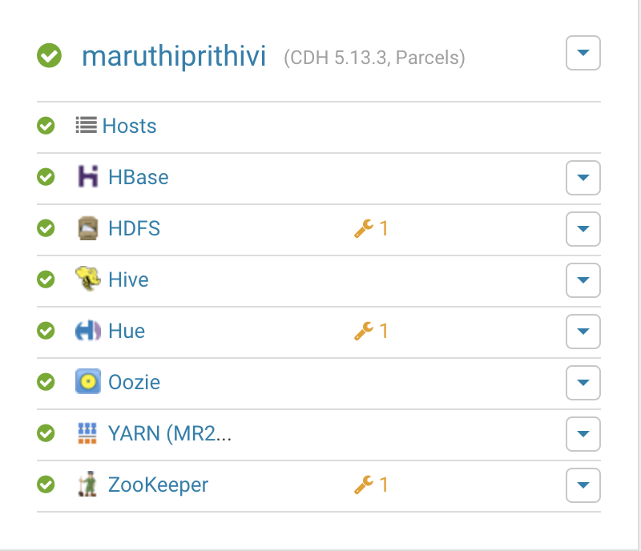
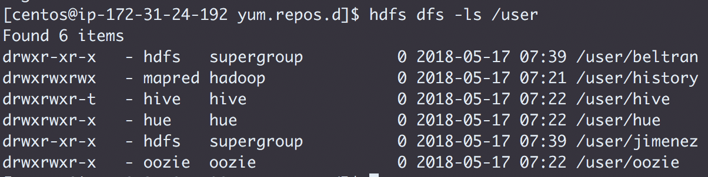
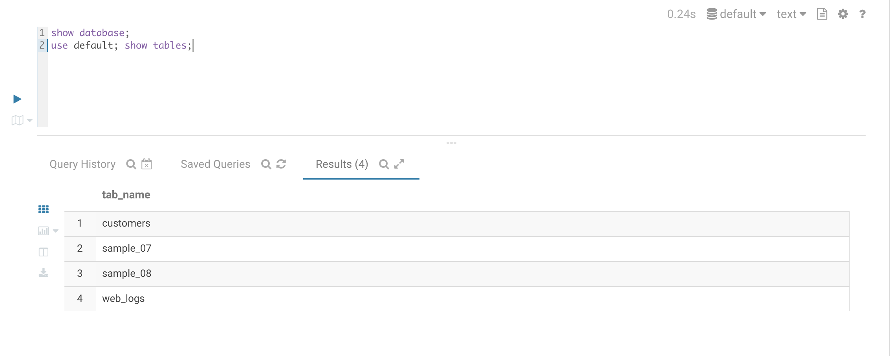

## <center> Challenge 3 - Install CDH 5.13

* Create the Issue `Install CDH`
* Assign yourself and label it `started`
* Deploy Coreset services + HBase
  * Rename your cluster after your GitHub handle
  
* Create user directories in HDFS for `jimenez` and `beltran`
  ```
  sudo -u hdfs hdfs dfs -mkdir /user/jimenez \
  && sudo -u hdfs hdfs dfs -mkdir /user/beltran
  ```
* Add the following to `3_cm.md`:
    * The command and output for `hdfs dfs -ls /user`
    
    * The command and output from the CM API call `../api/v5/hosts`
    ```
    {
  "items" : [ {
    "hostId" : "e53bad91-8eb8-4793-bea2-ad30605f92c0",
    "ipAddress" : "172.31.17.246",
    "hostname" : "ip-172-31-17-246.ap-southeast-1.compute.internal",
    "rackId" : "/default",
    "hostUrl" : "http://ip-172-31-28-114.ap-southeast-1.compute.internal:7180/cmf/hostRedirect/e53bad91-8eb8-4793-bea2-ad30605f92c0",
    "maintenanceMode" : false,
    "maintenanceOwners" : [ ],
    "commissionState" : "COMMISSIONED",
    "numCores" : 4,
    "totalPhysMemBytes" : 16656265216
  }, {
    "hostId" : "57b1ee57-8708-44e5-9c58-d373c1334728",
    "ipAddress" : "172.31.19.10",
    "hostname" : "ip-172-31-19-10.ap-southeast-1.compute.internal",
    "rackId" : "/default",
    "hostUrl" : "http://ip-172-31-28-114.ap-southeast-1.compute.internal:7180/cmf/hostRedirect/57b1ee57-8708-44e5-9c58-d373c1334728",
    "maintenanceMode" : false,
    "maintenanceOwners" : [ ],
    "commissionState" : "COMMISSIONED",
    "numCores" : 4,
    "totalPhysMemBytes" : 16656269312
  }, {
    "hostId" : "c3d7c2b0-54f0-4e14-a897-dc9d4087263e",
    "ipAddress" : "172.31.24.192",
    "hostname" : "ip-172-31-24-192.ap-southeast-1.compute.internal",
    "rackId" : "/default",
    "hostUrl" : "http://ip-172-31-28-114.ap-southeast-1.compute.internal:7180/cmf/hostRedirect/c3d7c2b0-54f0-4e14-a897-dc9d4087263e",
    "maintenanceMode" : false,
    "maintenanceOwners" : [ ],
    "commissionState" : "COMMISSIONED",
    "numCores" : 4,
    "totalPhysMemBytes" : 16656007168
  }, {
    "hostId" : "16b659ed-60a1-4bde-acf7-657e22c454f5",
    "ipAddress" : "172.31.28.114",
    "hostname" : "ip-172-31-28-114.ap-southeast-1.compute.internal",
    "rackId" : "/default",
    "hostUrl" : "http://ip-172-31-28-114.ap-southeast-1.compute.internal:7180/cmf/hostRedirect/16b659ed-60a1-4bde-acf7-657e22c454f5",
    "maintenanceMode" : false,
    "maintenanceOwners" : [ ],
    "commissionState" : "COMMISSIONED",
    "numCores" : 4,
    "totalPhysMemBytes" : 16656928768
  }, {
    "hostId" : "10cb7708-bd79-4d17-8498-b79754633c90",
    "ipAddress" : "172.31.29.13",
    "hostname" : "ip-172-31-29-13.ap-southeast-1.compute.internal",
    "rackId" : "/default",
    "hostUrl" : "http://ip-172-31-28-114.ap-southeast-1.compute.internal:7180/cmf/hostRedirect/10cb7708-bd79-4d17-8498-b79754633c90",
    "maintenanceMode" : false,
    "maintenanceOwners" : [ ],
    "commissionState" : "COMMISSIONED",
    "numCores" : 4,
    "totalPhysMemBytes" : 16656269312
  } ]
}
    ```
    * The command and output from the CM API call `../api/v11/clusters/<githubName>/services`
    ```
    {
  "items" : [ {
    "name" : "zookeeper",
    "type" : "ZOOKEEPER",
    "clusterRef" : {
      "clusterName" : "cluster"
    },
    "serviceUrl" : "http://ip-172-31-28-114.ap-southeast-1.compute.internal:7180/cmf/serviceRedirect/zookeeper",
    "roleInstancesUrl" : "http://ip-172-31-28-114.ap-southeast-1.compute.internal:7180/cmf/serviceRedirect/zookeeper/instances",
    "serviceState" : "STARTED",
    "healthSummary" : "GOOD",
    "healthChecks" : [ {
      "name" : "ZOOKEEPER_CANARY_HEALTH",
      "summary" : "GOOD",
      "suppressed" : false
    }, {
      "name" : "ZOOKEEPER_SERVERS_HEALTHY",
      "summary" : "GOOD",
      "suppressed" : false
    } ],
    "configStalenessStatus" : "FRESH",
    "clientConfigStalenessStatus" : "FRESH",
    "maintenanceMode" : false,
    "maintenanceOwners" : [ ],
    "displayName" : "ZooKeeper",
    "entityStatus" : "GOOD_HEALTH"
  }, {
    "name" : "oozie",
    "type" : "OOZIE",
    "clusterRef" : {
      "clusterName" : "cluster"
    },
    "serviceUrl" : "http://ip-172-31-28-114.ap-southeast-1.compute.internal:7180/cmf/serviceRedirect/oozie",
    "roleInstancesUrl" : "http://ip-172-31-28-114.ap-southeast-1.compute.internal:7180/cmf/serviceRedirect/oozie/instances",
    "serviceState" : "STARTED",
    "healthSummary" : "GOOD",
    "healthChecks" : [ {
      "name" : "OOZIE_OOZIE_SERVERS_HEALTHY",
      "summary" : "GOOD",
      "suppressed" : false
    } ],
    "configStalenessStatus" : "FRESH",
    "clientConfigStalenessStatus" : "FRESH",
    "maintenanceMode" : false,
    "maintenanceOwners" : [ ],
    "displayName" : "Oozie",
    "entityStatus" : "GOOD_HEALTH"
  }, {
    "name" : "hue",
    "type" : "HUE",
    "clusterRef" : {
      "clusterName" : "cluster"
    },
    "serviceUrl" : "http://ip-172-31-28-114.ap-southeast-1.compute.internal:7180/cmf/serviceRedirect/hue",
    "roleInstancesUrl" : "http://ip-172-31-28-114.ap-southeast-1.compute.internal:7180/cmf/serviceRedirect/hue/instances",
    "serviceState" : "STARTED",
    "healthSummary" : "GOOD",
    "healthChecks" : [ {
      "name" : "HUE_HUE_SERVERS_HEALTHY",
      "summary" : "GOOD",
      "suppressed" : false
    }, {
      "name" : "HUE_LOAD_BALANCER_HEALTHY",
      "summary" : "GOOD",
      "suppressed" : false
    } ],
    "configStalenessStatus" : "FRESH",
    "clientConfigStalenessStatus" : "FRESH",
    "maintenanceMode" : false,
    "maintenanceOwners" : [ ],
    "displayName" : "Hue",
    "entityStatus" : "GOOD_HEALTH"
  }, {
    "name" : "hdfs",
    "type" : "HDFS",
    "clusterRef" : {
      "clusterName" : "cluster"
    },
    "serviceUrl" : "http://ip-172-31-28-114.ap-southeast-1.compute.internal:7180/cmf/serviceRedirect/hdfs",
    "roleInstancesUrl" : "http://ip-172-31-28-114.ap-southeast-1.compute.internal:7180/cmf/serviceRedirect/hdfs/instances",
    "serviceState" : "STARTED",
    "healthSummary" : "GOOD",
    "healthChecks" : [ {
      "name" : "HDFS_BLOCKS_WITH_CORRUPT_REPLICAS",
      "summary" : "GOOD",
      "suppressed" : false
    }, {
      "name" : "HDFS_CANARY_HEALTH",
      "summary" : "GOOD",
      "suppressed" : false
    }, {
      "name" : "HDFS_DATA_NODES_HEALTHY",
      "summary" : "GOOD",
      "suppressed" : false
    }, {
      "name" : "HDFS_FREE_SPACE_REMAINING",
      "summary" : "GOOD",
      "suppressed" : false
    }, {
      "name" : "HDFS_HA_NAMENODE_HEALTH",
      "summary" : "GOOD",
      "suppressed" : false
    }, {
      "name" : "HDFS_MISSING_BLOCKS",
      "summary" : "GOOD",
      "suppressed" : false
    }, {
      "name" : "HDFS_UNDER_REPLICATED_BLOCKS",
      "summary" : "GOOD",
      "suppressed" : false
    } ],
    "configStalenessStatus" : "FRESH",
    "clientConfigStalenessStatus" : "FRESH",
    "maintenanceMode" : false,
    "maintenanceOwners" : [ ],
    "displayName" : "HDFS",
    "entityStatus" : "GOOD_HEALTH"
  }, {
    "name" : "yarn",
    "type" : "YARN",
    "clusterRef" : {
      "clusterName" : "cluster"
    },
    "serviceUrl" : "http://ip-172-31-28-114.ap-southeast-1.compute.internal:7180/cmf/serviceRedirect/yarn",
    "roleInstancesUrl" : "http://ip-172-31-28-114.ap-southeast-1.compute.internal:7180/cmf/serviceRedirect/yarn/instances",
    "serviceState" : "STARTED",
    "healthSummary" : "GOOD",
    "healthChecks" : [ {
      "name" : "YARN_JOBHISTORY_HEALTH",
      "summary" : "GOOD",
      "suppressed" : false
    }, {
      "name" : "YARN_NODE_MANAGERS_HEALTHY",
      "summary" : "GOOD",
      "suppressed" : false
    }, {
      "name" : "YARN_RESOURCEMANAGERS_HEALTH",
      "summary" : "GOOD",
      "suppressed" : false
    }, {
      "name" : "YARN_USAGE_AGGREGATION_HEALTH",
      "summary" : "DISABLED",
      "suppressed" : false
    } ],
    "configStalenessStatus" : "FRESH",
    "clientConfigStalenessStatus" : "FRESH",
    "maintenanceMode" : false,
    "maintenanceOwners" : [ ],
    "displayName" : "YARN (MR2 Included)",
    "entityStatus" : "GOOD_HEALTH"
  }, {
    "name" : "hbase",
    "type" : "HBASE",
    "clusterRef" : {
      "clusterName" : "cluster"
    },
    "serviceUrl" : "http://ip-172-31-28-114.ap-southeast-1.compute.internal:7180/cmf/serviceRedirect/hbase",
    "roleInstancesUrl" : "http://ip-172-31-28-114.ap-southeast-1.compute.internal:7180/cmf/serviceRedirect/hbase/instances",
    "serviceState" : "STARTED",
    "healthSummary" : "GOOD",
    "healthChecks" : [ {
      "name" : "HBASE_MASTER_HEALTH",
      "summary" : "GOOD",
      "suppressed" : false
    }, {
      "name" : "HBASE_REGION_SERVERS_HEALTHY",
      "summary" : "GOOD",
      "suppressed" : false
    } ],
    "configStalenessStatus" : "FRESH",
    "clientConfigStalenessStatus" : "FRESH",
    "maintenanceMode" : false,
    "maintenanceOwners" : [ ],
    "displayName" : "HBase",
    "entityStatus" : "GOOD_HEALTH"
  }, {
    "name" : "hive",
    "type" : "HIVE",
    "clusterRef" : {
      "clusterName" : "cluster"
    },
    "serviceUrl" : "http://ip-172-31-28-114.ap-southeast-1.compute.internal:7180/cmf/serviceRedirect/hive",
    "roleInstancesUrl" : "http://ip-172-31-28-114.ap-southeast-1.compute.internal:7180/cmf/serviceRedirect/hive/instances",
    "serviceState" : "STARTED",
    "healthSummary" : "GOOD",
    "healthChecks" : [ {
      "name" : "HIVE_HIVEMETASTORES_HEALTHY",
      "summary" : "GOOD",
      "suppressed" : false
    }, {
      "name" : "HIVE_HIVESERVER2S_HEALTHY",
      "summary" : "GOOD",
      "suppressed" : false
    } ],
    "configStalenessStatus" : "FRESH",
    "clientConfigStalenessStatus" : "FRESH",
    "maintenanceMode" : false,
    "maintenanceOwners" : [ ],
    "displayName" : "Hive",
    "entityStatus" : "GOOD_HEALTH"
  } ]
}
    ```
* Install the Hive sample data using Hue
    * Copy a Hue screen that shows the tables are loaded to `challenges/labs/3_hue_hive.png`
    
* Push this work to GitHub and label the Issue `review`
* Assign the issue to the instructor
