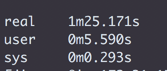
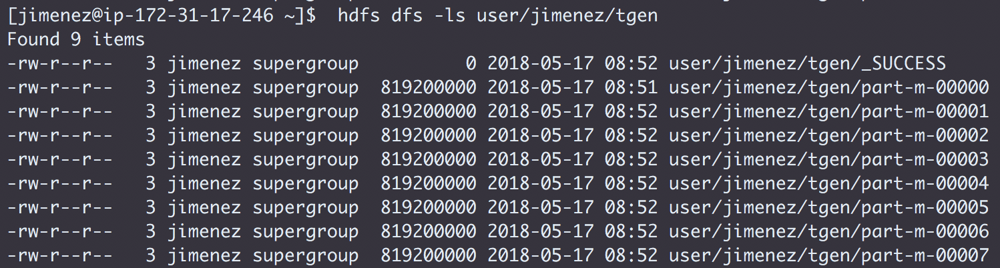
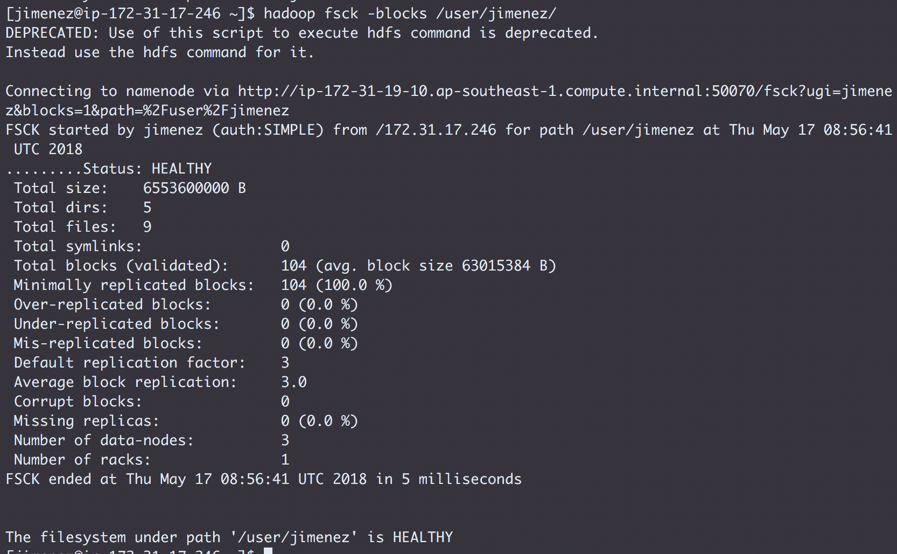

## 
 Challenge 4 - HDFS Testing

* Create the Issue `Test HDFS`
* Assign yourself and label it `started`
* As user `jimenez`, use `teragen` to generate a 65,536,000-record dataset
  * Write the output to 8 files
  * Set the block size to 64 MB
  * Set the mapper container size to 512 MiB
  * Name the target directory `tgen`
  * Use the `time` command to capture job duration
* Put the following in `challenges/labs/4_teragen.md`
  * The full `teragen` command and output
    `time hadoop jar /opt/cloudera/parcels/CDH-5.13.3-1.cdh5.13.3.p0.2/jars/hadoop-examples.jar teragen -Ddfs.block.size=67108864 -Dmapreduce.map.memory.mb=512 -Dmapred.map.tasks=8 65536000 user/jimenez/tgen`
  * The result of the `time` command
  
  * The command and output of `hdfs dfs -ls /user/jimenez/tgen`
  
  * The command and output of `hadoop fsck -blocks /user/jimenez`
  
* Push this work to GitHub and label the Issue `review`
* Assign the issue to the instructors
