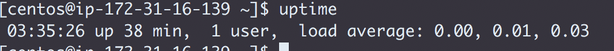
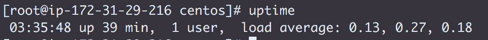
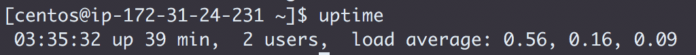
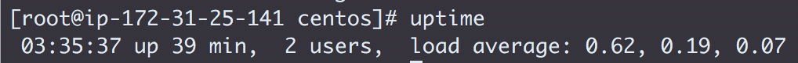
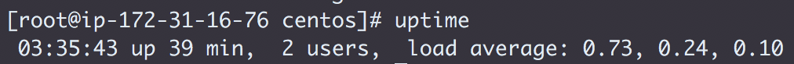
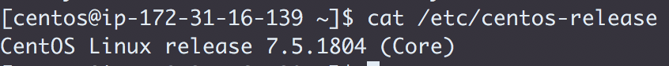
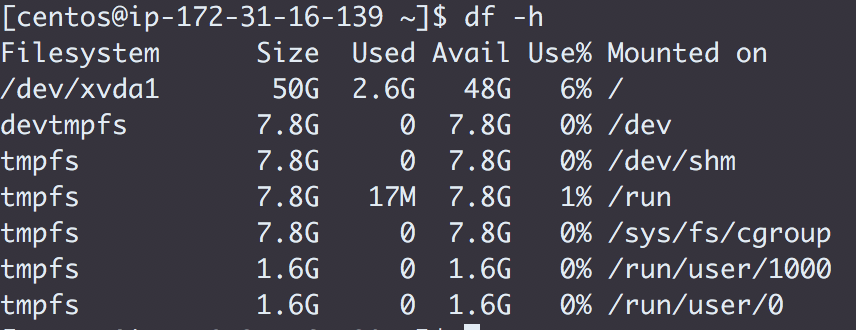
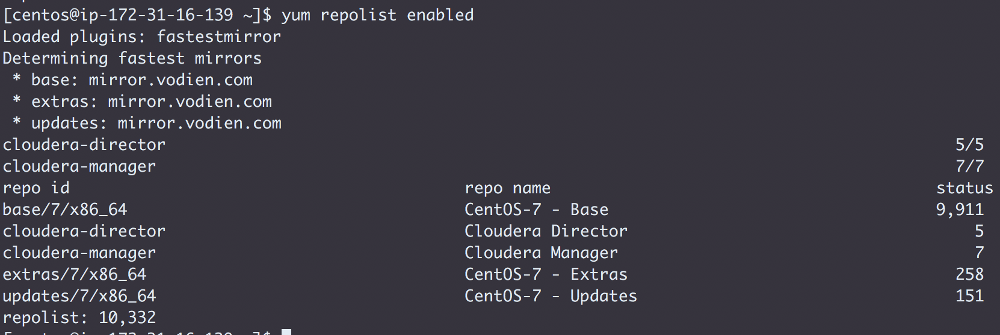
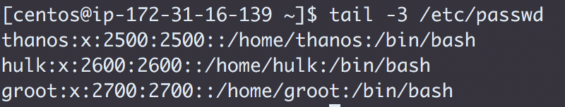
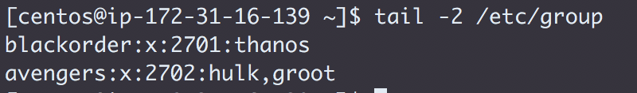

* Create the Issue `Exit-test: Setup`
* Make sure `manojsundaram` is a Collaborator
* Assign the Issue to yourself and label it `started`
* Destroy your lab and challenge instances and create 5 new instances (Follow the same instructions from the lab, plus make sure your root volume EBS storage has 50 GB allocated).
* In the file `challenges/labs/0_setup.md`:
  * Run the `uptime` command on every node
  
  
  
  
  
  * List the cloud provider you are using         
  **AWS**
  * List your instances by IP address and DNS name (don't use `/etc/hosts` for this)
  ```
  172.31.16.139  ip-172-31-16-139.ap-southeast-1.compute.internal
  172.31.29.216  ip-172-31-29-216.ap-southeast-1.compute.internal
  172.31.24.231  ip-172-31-24-231.ap-southeast-1.compute.internal
  172.31.25.141  ip-172-31-25-141.ap-southeast-1.compute.internal
  172.31.16.76  ip-172-31-16-76.ap-southeast-1.compute.internal
  ```
  * List the Linux release you are using
  

  * List the file system capacity for the first node
  

  * List the command and output for `yum repolist enabled`
  

* Add the following Linux accounts to all nodes
  * User `thanos` with a UID of `2500`
  * User `hulk` with a UID of `2600`
  * User `groot` with a UID of `2700`
  ```
  sudo adduser -u 2500 thanos \
  && sudo adduser -u 2600 hulk \
  && sudo adduser -u 2700 groot
  ```
  * Create the group `blackorder` and add `thanos` to it
  * Create the group `avengers` and add `hulk`, `groot` to it
  ```
  sudo groupadd blackorder \
  && sudo groupadd avengers \
  && sudo usermod -aG blackorder thanos \
  && sudo usermod -aG avengers hulk \
  && sudo usermod -aG avengers groot
  ```
* List the `/etc/passwd` entries for `all 3 users`
  * Do not list the entire file
  
* List the `/etc/group` entries for `blackorder` and `avengers`
  * Do not list the entire file
  
* Push these updates to GitHub
* Label your Issue `review`
* Assign the Issue to the instructor
