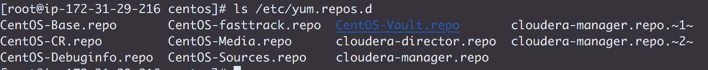

## 
 Challenge 2: Install Cloudera Manager 5.11.2

* Create the Issue `Exit-test: Install CM`
* Assign yourself and label it `started`
* Install Cloudera Manager on the second node listed in `0_setup.md`
* List the command and output for `ls /etc/yum.repos.d` in `challenges/labs/1_cm.md`
  
  * Copy `cloudera-manager.repo` to `challenges/labs/2_cloudera-manager.repo.md`

* Connect Cloudera Manager Server to its database
  * Use the `scm_prepare_database.sh` script to create the `db.properties` file
  * List the full command and its output in `2_properties.md`
  * Add the `db.properties` file content to `2_properties.md`
* Start the Cloudera Manager server
* In `challenges/labs/2_cm_startup.md` add:
  * The first line of the server log
  * The line(s) that contain the phrase "Started Jetty server"
* Push these changes to GitHub and label the Issue `review`
* Assign the issue to the instructor
