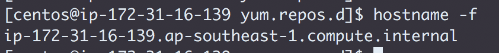
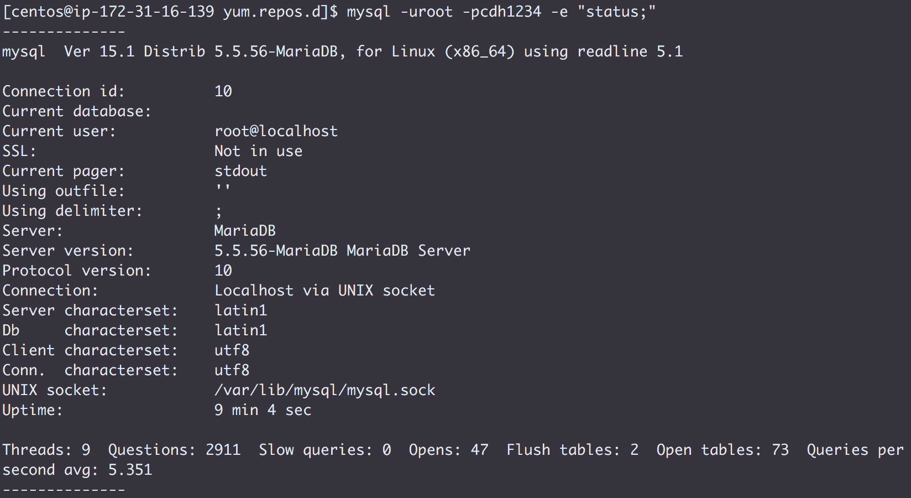
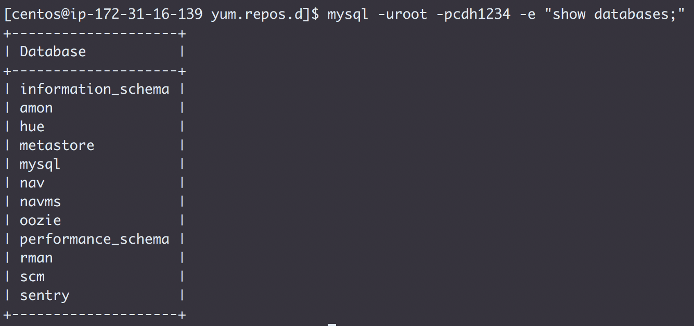

## 
 Challenge 1: Install a MySQL/MariaDB server

* Create the Issue `Exit-test: Install Database`
* Assign the Issue to yourself and label it `started`
* Install MySQL 5.5 or MariaDB 5.5 on the first node listed in `0_setup.md`
  * Use a YUM repository to install the package
  * Copy the repo configuration you use to `challenges/labs/1_my-database-server.repo.md`
* On all cluster nodes
  * Install the database client package and JDBC connector jar on all nodes
* Start the server and create these databases:
  * `scm`
  * `rman`
  * `hive`
  * `oozie`
  * `hue`
  * `sentry`
* Record the following in `challenges/labs/1_db-server.md`
  * The command `hostname -f` and its output
  
  * The command `mysql -u <user> -p<password> -e "status;"` and its output
  
  * The command `mysql -u <user>  -p<password> -e "show databases;"` and its output
  
* Push this work to GitHub
* Label the Issue `review` and assign it to the instructor
