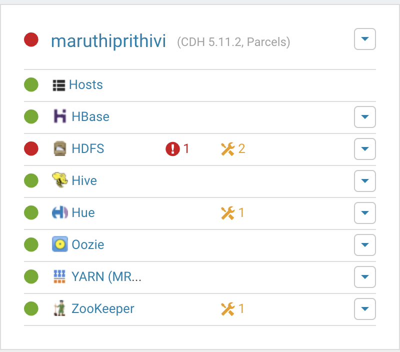
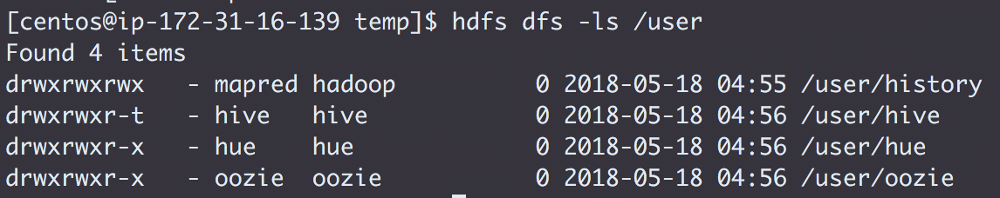
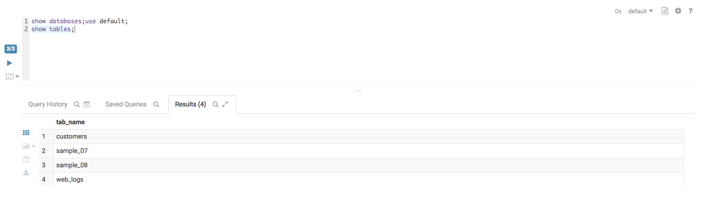

## <center> Challenge 3 - Install CDH 5.11.2.4

* Create the Issue `Exit-test: Install CDH`
* Assign yourself and label it `started`
* You `must` create and install CDH from a local repository only
* Take a screenshot of the page from Cloudera Manager containing the parcel location from where you installed
* Deploy Coreset services + HBase
  * Rename your cluster after your `GitHub handle`
  
* Create user directories in HDFS for `thanos`, `hulk` and `groot`
* Add the following to `3_cm.md`:
    * The command and output for `hdfs dfs -ls /user`
    
    * The command and output from the CM API call `../api/v5/hosts`
    ```
    {
      "items" : [ {
        "hostId" : "b7d1c601-857d-4dc5-b89b-5ad57e46a313",
        "ipAddress" : "172.31.16.139",
        "hostname" : "ip-172-31-16-139.ap-southeast-1.compute.internal",
        "rackId" : "/default",
        "hostUrl" : "http://ip-172-31-29-216.ap-southeast-1.compute.internal:7180/cmf/hostRedirect/b7d1c601-857d-4dc5-b89b-5ad57e46a313",
        "maintenanceMode" : false,
        "maintenanceOwners" : [ ],
        "commissionState" : "COMMISSIONED",
        "numCores" : 4,
        "totalPhysMemBytes" : 16656269312
      }, {
        "hostId" : "ab74e83f-712d-4110-92c5-6ccb9051c66d",
        "ipAddress" : "172.31.16.76",
        "hostname" : "ip-172-31-16-76.ap-southeast-1.compute.internal",
        "rackId" : "/default",
        "hostUrl" : "http://ip-172-31-29-216.ap-southeast-1.compute.internal:7180/cmf/hostRedirect/ab74e83f-712d-4110-92c5-6ccb9051c66d",
        "maintenanceMode" : false,
        "maintenanceOwners" : [ ],
        "commissionState" : "COMMISSIONED",
        "numCores" : 4,
        "totalPhysMemBytes" : 16656269312
      }, {
        "hostId" : "35883799-c4ab-42e7-bbb6-6d832b8f9791",
        "ipAddress" : "172.31.24.231",
        "hostname" : "ip-172-31-24-231.ap-southeast-1.compute.internal",
        "rackId" : "/default",
        "hostUrl" : "http://ip-172-31-29-216.ap-southeast-1.compute.internal:7180/cmf/hostRedirect/35883799-c4ab-42e7-bbb6-6d832b8f9791",
        "maintenanceMode" : false,
        "maintenanceOwners" : [ ],
        "commissionState" : "COMMISSIONED",
        "numCores" : 4,
        "totalPhysMemBytes" : 16656269312
      }, {
        "hostId" : "1bc7249e-9d2d-4a01-ae2a-13091ceea6a9",
        "ipAddress" : "172.31.25.141",
        "hostname" : "ip-172-31-25-141.ap-southeast-1.compute.internal",
        "rackId" : "/default",
        "hostUrl" : "http://ip-172-31-29-216.ap-southeast-1.compute.internal:7180/cmf/hostRedirect/1bc7249e-9d2d-4a01-ae2a-13091ceea6a9",
        "maintenanceMode" : false,
        "maintenanceOwners" : [ ],
        "commissionState" : "COMMISSIONED",
        "numCores" : 4,
        "totalPhysMemBytes" : 16656269312
      }, {
        "hostId" : "f60c6470-1479-4707-b3c5-6aed3c8d391a",
        "ipAddress" : "172.31.29.216",
        "hostname" : "ip-172-31-29-216.ap-southeast-1.compute.internal",
        "rackId" : "/default",
        "hostUrl" : "http://ip-172-31-29-216.ap-southeast-1.compute.internal:7180/cmf/hostRedirect/f60c6470-1479-4707-b3c5-6aed3c8d391a",
        "maintenanceMode" : false,
        "maintenanceOwners" : [ ],
        "commissionState" : "COMMISSIONED",
        "numCores" : 4,
        "totalPhysMemBytes" : 16656269312
      } ]
    }
    ```
    * The command and output from the CM API call `../api/v11/clusters/<githubName>/services`
    ```
    {
  "items" : [ {
    "name" : "zookeeper",
    "type" : "ZOOKEEPER",
    "clusterRef" : {
      "clusterName" : "cluster"
    },
    "serviceUrl" : "http://ip-172-31-29-216.ap-southeast-1.compute.internal:7180/cmf/serviceRedirect/zookeeper",
    "roleInstancesUrl" : "http://ip-172-31-29-216.ap-southeast-1.compute.internal:7180/cmf/serviceRedirect/zookeeper/instances",
    "serviceState" : "STARTED",
    "healthSummary" : "GOOD",
    "healthChecks" : [ {
      "name" : "ZOOKEEPER_CANARY_HEALTH",
      "summary" : "GOOD",
      "suppressed" : false
    }, {
      "name" : "ZOOKEEPER_SERVERS_HEALTHY",
      "summary" : "GOOD",
      "suppressed" : false
    } ],
    "configStalenessStatus" : "FRESH",
    "clientConfigStalenessStatus" : "FRESH",
    "maintenanceMode" : false,
    "maintenanceOwners" : [ ],
    "displayName" : "ZooKeeper",
    "entityStatus" : "GOOD_HEALTH"
  }, {
    "name" : "oozie",
    "type" : "OOZIE",
    "clusterRef" : {
      "clusterName" : "cluster"
    },
    "serviceUrl" : "http://ip-172-31-29-216.ap-southeast-1.compute.internal:7180/cmf/serviceRedirect/oozie",
    "roleInstancesUrl" : "http://ip-172-31-29-216.ap-southeast-1.compute.internal:7180/cmf/serviceRedirect/oozie/instances",
    "serviceState" : "STARTED",
    "healthSummary" : "GOOD",
    "healthChecks" : [ {
      "name" : "OOZIE_OOZIE_SERVERS_HEALTHY",
      "summary" : "GOOD",
      "suppressed" : false
    } ],
    "configStalenessStatus" : "FRESH",
    "clientConfigStalenessStatus" : "FRESH",
    "maintenanceMode" : false,
    "maintenanceOwners" : [ ],
    "displayName" : "Oozie",
    "entityStatus" : "GOOD_HEALTH"
  }, {
    "name" : "hue",
    "type" : "HUE",
    "clusterRef" : {
      "clusterName" : "cluster"
    },
    "serviceUrl" : "http://ip-172-31-29-216.ap-southeast-1.compute.internal:7180/cmf/serviceRedirect/hue",
    "roleInstancesUrl" : "http://ip-172-31-29-216.ap-southeast-1.compute.internal:7180/cmf/serviceRedirect/hue/instances",
    "serviceState" : "STARTED",
    "healthSummary" : "GOOD",
    "healthChecks" : [ {
      "name" : "HUE_HUE_SERVERS_HEALTHY",
      "summary" : "GOOD",
      "suppressed" : false
    } ],
    "configStalenessStatus" : "FRESH",
    "clientConfigStalenessStatus" : "FRESH",
    "maintenanceMode" : false,
    "maintenanceOwners" : [ ],
    "displayName" : "Hue",
    "entityStatus" : "GOOD_HEALTH"
  }, {
    "name" : "hdfs",
    "type" : "HDFS",
    "clusterRef" : {
      "clusterName" : "cluster"
    },
    "serviceUrl" : "http://ip-172-31-29-216.ap-southeast-1.compute.internal:7180/cmf/serviceRedirect/hdfs",
    "roleInstancesUrl" : "http://ip-172-31-29-216.ap-southeast-1.compute.internal:7180/cmf/serviceRedirect/hdfs/instances",
    "serviceState" : "STARTED",
    "healthSummary" : "BAD",
    "healthChecks" : [ {
      "name" : "HDFS_BLOCKS_WITH_CORRUPT_REPLICAS",
      "summary" : "GOOD",
      "suppressed" : false
    }, {
      "name" : "HDFS_CANARY_HEALTH",
      "summary" : "GOOD",
      "suppressed" : false
    }, {
      "name" : "HDFS_DATA_NODES_HEALTHY",
      "summary" : "GOOD",
      "suppressed" : false
    }, {
      "name" : "HDFS_FREE_SPACE_REMAINING",
      "summary" : "GOOD",
      "suppressed" : false
    }, {
      "name" : "HDFS_HA_NAMENODE_HEALTH",
      "summary" : "GOOD",
      "suppressed" : false
    }, {
      "name" : "HDFS_MISSING_BLOCKS",
      "summary" : "GOOD",
      "suppressed" : false
    }, {
      "name" : "HDFS_UNDER_REPLICATED_BLOCKS",
      "summary" : "BAD",
      "suppressed" : false
    } ],
    "configStalenessStatus" : "FRESH",
    "clientConfigStalenessStatus" : "FRESH",
    "maintenanceMode" : false,
    "maintenanceOwners" : [ ],
    "displayName" : "HDFS",
    "entityStatus" : "BAD_HEALTH"
  }, {
    "name" : "yarn",
    "type" : "YARN",
    "clusterRef" : {
      "clusterName" : "cluster"
    },
    "serviceUrl" : "http://ip-172-31-29-216.ap-southeast-1.compute.internal:7180/cmf/serviceRedirect/yarn",
    "roleInstancesUrl" : "http://ip-172-31-29-216.ap-southeast-1.compute.internal:7180/cmf/serviceRedirect/yarn/instances",
    "serviceState" : "STARTED",
    "healthSummary" : "GOOD",
    "healthChecks" : [ {
      "name" : "YARN_JOBHISTORY_HEALTH",
      "summary" : "GOOD",
      "suppressed" : false
    }, {
      "name" : "YARN_NODE_MANAGERS_HEALTHY",
      "summary" : "GOOD",
      "suppressed" : false
    }, {
      "name" : "YARN_RESOURCEMANAGERS_HEALTH",
      "summary" : "GOOD",
      "suppressed" : false
    }, {
      "name" : "YARN_USAGE_AGGREGATION_HEALTH",
      "summary" : "DISABLED",
      "suppressed" : false
    } ],
    "configStalenessStatus" : "FRESH",
    "clientConfigStalenessStatus" : "FRESH",
    "maintenanceMode" : false,
    "maintenanceOwners" : [ ],
    "displayName" : "YARN (MR2 Included)",
    "entityStatus" : "GOOD_HEALTH"
  }, {
    "name" : "hbase",
    "type" : "HBASE",
    "clusterRef" : {
      "clusterName" : "cluster"
    },
    "serviceUrl" : "http://ip-172-31-29-216.ap-southeast-1.compute.internal:7180/cmf/serviceRedirect/hbase",
    "roleInstancesUrl" : "http://ip-172-31-29-216.ap-southeast-1.compute.internal:7180/cmf/serviceRedirect/hbase/instances",
    "serviceState" : "STARTED",
    "healthSummary" : "GOOD",
    "healthChecks" : [ {
      "name" : "HBASE_MASTER_HEALTH",
      "summary" : "GOOD",
      "suppressed" : false
    }, {
      "name" : "HBASE_REGION_SERVERS_HEALTHY",
      "summary" : "GOOD",
      "suppressed" : false
    } ],
    "configStalenessStatus" : "FRESH",
    "clientConfigStalenessStatus" : "FRESH",
    "maintenanceMode" : false,
    "maintenanceOwners" : [ ],
    "displayName" : "HBase",
    "entityStatus" : "GOOD_HEALTH"
  }, {
    "name" : "hive",
    "type" : "HIVE",
    "clusterRef" : {
      "clusterName" : "cluster"
    },
    "serviceUrl" : "http://ip-172-31-29-216.ap-southeast-1.compute.internal:7180/cmf/serviceRedirect/hive",
    "roleInstancesUrl" : "http://ip-172-31-29-216.ap-southeast-1.compute.internal:7180/cmf/serviceRedirect/hive/instances",
    "serviceState" : "STARTED",
    "healthSummary" : "GOOD",
    "healthChecks" : [ {
      "name" : "HIVE_HIVEMETASTORES_HEALTHY",
      "summary" : "GOOD",
      "suppressed" : false
    }, {
      "name" : "HIVE_HIVESERVER2S_HEALTHY",
      "summary" : "GOOD",
      "suppressed" : false
    } ],
    "configStalenessStatus" : "FRESH",
    "clientConfigStalenessStatus" : "FRESH",
    "maintenanceMode" : false,
    "maintenanceOwners" : [ ],
    "displayName" : "Hive",
    "entityStatus" : "GOOD_HEALTH"
  } ]
}
    ```
* Install the Hive sample data using Hue (IMPORTANT: You should use only this dataset for Challenge 6)
    * Copy a Hue screen that shows the tables are loaded to `challenges/labs/3_hue_hive.png`
    
* Add the output of the following to `3_deploymentjson.md`
    * The command and output from the CM API call `../api/v14/cm/deployment`
    ```
    {
  "timestamp" : "2018-05-18T05:06:13.575Z",
  "clusters" : [ {
    "name" : "cluster",
    "displayName" : "maruthiprithivi",
    "version" : "CDH5",
    "fullVersion" : "5.11.2",
    "services" : [ {
      "name" : "zookeeper",
      "type" : "ZOOKEEPER",
      "config" : {
        "items" : [ ]
      },
      "roles" : [ {
        "name" : "zookeeper-SERVER-f002d057cd8b03e692f9a6c89dec4a35",
        "type" : "SERVER",
        "hostRef" : {
          "hostId" : "b7d1c601-857d-4dc5-b89b-5ad57e46a313"
        },
        "config" : {
          "items" : [ {
            "name" : "role_jceks_password",
            "value" : "3uil8fh01uo5c134a5ee3yjsx",
            "sensitive" : true
          }, {
            "name" : "serverId",
            "value" : "1",
            "sensitive" : false
          } ]
        },
        "roleConfigGroupRef" : {
          "roleConfigGroupName" : "zookeeper-SERVER-BASE"
        }
      } ],
      "displayName" : "ZooKeeper",
      "roleConfigGroups" : [ {
        "name" : "zookeeper-SERVER-BASE",
        "displayName" : "Server Default Group",
        "roleType" : "SERVER",
        "base" : true,
        "serviceRef" : {
          "clusterName" : "cluster",
          "serviceName" : "zookeeper"
        },
        "config" : {
          "items" : [ {
            "name" : "maxSessionTimeout",
            "value" : "60000",
            "sensitive" : false
          }, {
            "name" : "zookeeper_server_java_heapsize",
            "value" : "405798912",
            "sensitive" : false
          } ]
        }
      } ]
    }, {
      "name" : "oozie",
      "type" : "OOZIE",
      "config" : {
        "items" : [ {
          "name" : "hive_service",
          "value" : "hive",
          "sensitive" : false
        }, {
          "name" : "mapreduce_yarn_service",
          "value" : "yarn",
          "sensitive" : false
        }, {
          "name" : "zookeeper_service",
          "value" : "zookeeper",
          "sensitive" : false
        } ]
      },
      "roles" : [ {
        "name" : "oozie-OOZIE_SERVER-f002d057cd8b03e692f9a6c89dec4a35",
        "type" : "OOZIE_SERVER",
        "hostRef" : {
          "hostId" : "b7d1c601-857d-4dc5-b89b-5ad57e46a313"
        },
        "config" : {
          "items" : [ {
            "name" : "role_jceks_password",
            "value" : "820zg2mqpodol7958w8ug1gpi",
            "sensitive" : true
          } ]
        },
        "roleConfigGroupRef" : {
          "roleConfigGroupName" : "oozie-OOZIE_SERVER-BASE"
        }
      } ],
      "displayName" : "Oozie",
      "roleConfigGroups" : [ {
        "name" : "oozie-OOZIE_SERVER-BASE",
        "displayName" : "Oozie Server Default Group",
        "roleType" : "OOZIE_SERVER",
        "base" : true,
        "serviceRef" : {
          "clusterName" : "cluster",
          "serviceName" : "oozie"
        },
        "config" : {
          "items" : [ {
            "name" : "oozie_database_host",
            "value" : "ip-172-31-16-139.ap-southeast-1.compute.internal",
            "sensitive" : false
          }, {
            "name" : "oozie_database_password",
            "value" : "oozie_password",
            "sensitive" : true
          }, {
            "name" : "oozie_database_type",
            "value" : "mysql",
            "sensitive" : false
          }, {
            "name" : "oozie_database_user",
            "value" : "oozie",
            "sensitive" : false
          }, {
            "name" : "oozie_java_heapsize",
            "value" : "405798912",
            "sensitive" : false
          } ]
        }
      } ]
    }, {
      "name" : "hue",
      "type" : "HUE",
      "config" : {
        "items" : [ {
          "name" : "database_host",
          "value" : "ip-172-31-16-139.ap-southeast-1.compute.internal",
          "sensitive" : false
        }, {
          "name" : "database_password",
          "value" : "hue_password",
          "sensitive" : true
        }, {
          "name" : "database_type",
          "value" : "mysql",
          "sensitive" : false
        }, {
          "name" : "hbase_service",
          "value" : "hbase",
          "sensitive" : false
        }, {
          "name" : "hive_service",
          "value" : "hive",
          "sensitive" : false
        }, {
          "name" : "hue_webhdfs",
          "value" : "hdfs-NAMENODE-f002d057cd8b03e692f9a6c89dec4a35",
          "sensitive" : false
        }, {
          "name" : "oozie_service",
          "value" : "oozie",
          "sensitive" : false
        }, {
          "name" : "zookeeper_service",
          "value" : "zookeeper",
          "sensitive" : false
        } ]
      },
      "roles" : [ {
        "name" : "hue-HUE_SERVER-f002d057cd8b03e692f9a6c89dec4a35",
        "type" : "HUE_SERVER",
        "hostRef" : {
          "hostId" : "b7d1c601-857d-4dc5-b89b-5ad57e46a313"
        },
        "config" : {
          "items" : [ {
            "name" : "role_jceks_password",
            "value" : "5dvbrn2fh0e1yp1x7pge3xdph",
            "sensitive" : true
          }, {
            "name" : "secret_key",
            "value" : "6bUd5WC9WnEWgnAZD01wnVD2pEgdyR",
            "sensitive" : true
          } ]
        },
        "roleConfigGroupRef" : {
          "roleConfigGroupName" : "hue-HUE_SERVER-BASE"
        }
      } ],
      "displayName" : "Hue",
      "roleConfigGroups" : [ {
        "name" : "hue-HUE_LOAD_BALANCER-BASE",
        "displayName" : "Load Balancer Default Group",
        "roleType" : "HUE_LOAD_BALANCER",
        "base" : true,
        "serviceRef" : {
          "clusterName" : "cluster",
          "serviceName" : "hue"
        },
        "config" : {
          "items" : [ ]
        }
      }, {
        "name" : "hue-HUE_SERVER-BASE",
        "displayName" : "Hue Server Default Group",
        "roleType" : "HUE_SERVER",
        "base" : true,
        "serviceRef" : {
          "clusterName" : "cluster",
          "serviceName" : "hue"
        },
        "config" : {
          "items" : [ ]
        }
      }, {
        "name" : "hue-KT_RENEWER-BASE",
        "displayName" : "Kerberos Ticket Renewer Default Group",
        "roleType" : "KT_RENEWER",
        "base" : true,
        "serviceRef" : {
          "clusterName" : "cluster",
          "serviceName" : "hue"
        },
        "config" : {
          "items" : [ ]
        }
      } ]
    }, {
      "name" : "hdfs",
      "type" : "HDFS",
      "config" : {
        "items" : [ {
          "name" : "dfs_ha_fencing_cloudera_manager_secret_key",
          "value" : "b3A9QRzBBidcQKRYNRhEuKQLyVzalI",
          "sensitive" : true
        }, {
          "name" : "fc_authorization_secret_key",
          "value" : "w1rDBXkJ2FqfBGxgxu7iom0E3ax5hz",
          "sensitive" : true
        }, {
          "name" : "http_auth_signature_secret",
          "value" : "KKx3VxEay2SYW5xE9UFXOTzdRX8fGB",
          "sensitive" : true
        }, {
          "name" : "rm_dirty",
          "value" : "true",
          "sensitive" : false
        }, {
          "name" : "zookeeper_service",
          "value" : "zookeeper",
          "sensitive" : false
        } ]
      },
      "roles" : [ {
        "name" : "hdfs-BALANCER-f002d057cd8b03e692f9a6c89dec4a35",
        "type" : "BALANCER",
        "hostRef" : {
          "hostId" : "b7d1c601-857d-4dc5-b89b-5ad57e46a313"
        },
        "config" : {
          "items" : [ ]
        },
        "roleConfigGroupRef" : {
          "roleConfigGroupName" : "hdfs-BALANCER-BASE"
        }
      }, {
        "name" : "hdfs-DATANODE-f002d057cd8b03e692f9a6c89dec4a35",
        "type" : "DATANODE",
        "hostRef" : {
          "hostId" : "b7d1c601-857d-4dc5-b89b-5ad57e46a313"
        },
        "config" : {
          "items" : [ {
            "name" : "role_jceks_password",
            "value" : "2u4i9rtau6u11z23fno90a0ez",
            "sensitive" : true
          } ]
        },
        "roleConfigGroupRef" : {
          "roleConfigGroupName" : "hdfs-DATANODE-BASE"
        }
      }, {
        "name" : "hdfs-NAMENODE-f002d057cd8b03e692f9a6c89dec4a35",
        "type" : "NAMENODE",
        "hostRef" : {
          "hostId" : "b7d1c601-857d-4dc5-b89b-5ad57e46a313"
        },
        "config" : {
          "items" : [ {
            "name" : "namenode_id",
            "value" : "31",
            "sensitive" : false
          }, {
            "name" : "role_jceks_password",
            "value" : "7shggkwxozlwfzwiti5jvos0g",
            "sensitive" : true
          } ]
        },
        "roleConfigGroupRef" : {
          "roleConfigGroupName" : "hdfs-NAMENODE-BASE"
        }
      }, {
        "name" : "hdfs-SECONDARYNAMENODE-f002d057cd8b03e692f9a6c89dec4a35",
        "type" : "SECONDARYNAMENODE",
        "hostRef" : {
          "hostId" : "b7d1c601-857d-4dc5-b89b-5ad57e46a313"
        },
        "config" : {
          "items" : [ {
            "name" : "role_jceks_password",
            "value" : "a8tijpj9f39yib87870twqr03",
            "sensitive" : true
          } ]
        },
        "roleConfigGroupRef" : {
          "roleConfigGroupName" : "hdfs-SECONDARYNAMENODE-BASE"
        }
      } ],
      "displayName" : "HDFS",
      "roleConfigGroups" : [ {
        "name" : "hdfs-BALANCER-BASE",
        "displayName" : "Balancer Default Group",
        "roleType" : "BALANCER",
        "base" : true,
        "serviceRef" : {
          "clusterName" : "cluster",
          "serviceName" : "hdfs"
        },
        "config" : {
          "items" : [ {
            "name" : "balancer_java_heapsize",
            "value" : "405798912",
            "sensitive" : false
          } ]
        }
      }, {
        "name" : "hdfs-DATANODE-BASE",
        "displayName" : "DataNode Default Group",
        "roleType" : "DATANODE",
        "base" : true,
        "serviceRef" : {
          "clusterName" : "cluster",
          "serviceName" : "hdfs"
        },
        "config" : {
          "items" : [ {
            "name" : "datanode_java_heapsize",
            "value" : "405798912",
            "sensitive" : false
          }, {
            "name" : "dfs_data_dir_list",
            "value" : "/dfs/dn",
            "sensitive" : false
          }, {
            "name" : "dfs_datanode_du_reserved",
            "value" : "5367553638",
            "sensitive" : false
          }, {
            "name" : "dfs_datanode_max_locked_memory",
            "value" : "527433728",
            "sensitive" : false
          } ]
        }
      }, {
        "name" : "hdfs-FAILOVERCONTROLLER-BASE",
        "displayName" : "Failover Controller Default Group",
        "roleType" : "FAILOVERCONTROLLER",
        "base" : true,
        "serviceRef" : {
          "clusterName" : "cluster",
          "serviceName" : "hdfs"
        },
        "config" : {
          "items" : [ ]
        }
      }, {
        "name" : "hdfs-GATEWAY-BASE",
        "displayName" : "Gateway Default Group",
        "roleType" : "GATEWAY",
        "base" : true,
        "serviceRef" : {
          "clusterName" : "cluster",
          "serviceName" : "hdfs"
        },
        "config" : {
          "items" : [ {
            "name" : "dfs_client_use_trash",
            "value" : "true",
            "sensitive" : false
          } ]
        }
      }, {
        "name" : "hdfs-HTTPFS-BASE",
        "displayName" : "HttpFS Default Group",
        "roleType" : "HTTPFS",
        "base" : true,
        "serviceRef" : {
          "clusterName" : "cluster",
          "serviceName" : "hdfs"
        },
        "config" : {
          "items" : [ ]
        }
      }, {
        "name" : "hdfs-JOURNALNODE-BASE",
        "displayName" : "JournalNode Default Group",
        "roleType" : "JOURNALNODE",
        "base" : true,
        "serviceRef" : {
          "clusterName" : "cluster",
          "serviceName" : "hdfs"
        },
        "config" : {
          "items" : [ ]
        }
      }, {
        "name" : "hdfs-NAMENODE-BASE",
        "displayName" : "NameNode Default Group",
        "roleType" : "NAMENODE",
        "base" : true,
        "serviceRef" : {
          "clusterName" : "cluster",
          "serviceName" : "hdfs"
        },
        "config" : {
          "items" : [ {
            "name" : "dfs_name_dir_list",
            "value" : "/dfs/nn",
            "sensitive" : false
          }, {
            "name" : "dfs_namenode_servicerpc_address",
            "value" : "8022",
            "sensitive" : false
          }, {
            "name" : "namenode_java_heapsize",
            "value" : "405798912",
            "sensitive" : false
          } ]
        }
      }, {
        "name" : "hdfs-NFSGATEWAY-BASE",
        "displayName" : "NFS Gateway Default Group",
        "roleType" : "NFSGATEWAY",
        "base" : true,
        "serviceRef" : {
          "clusterName" : "cluster",
          "serviceName" : "hdfs"
        },
        "config" : {
          "items" : [ ]
        }
      }, {
        "name" : "hdfs-SECONDARYNAMENODE-BASE",
        "displayName" : "SecondaryNameNode Default Group",
        "roleType" : "SECONDARYNAMENODE",
        "base" : true,
        "serviceRef" : {
          "clusterName" : "cluster",
          "serviceName" : "hdfs"
        },
        "config" : {
          "items" : [ {
            "name" : "fs_checkpoint_dir_list",
            "value" : "/dfs/snn",
            "sensitive" : false
          }, {
            "name" : "secondary_namenode_java_heapsize",
            "value" : "405798912",
            "sensitive" : false
          } ]
        }
      } ],
      "replicationSchedules" : [ ],
      "snapshotPolicies" : [ ]
    }, {
      "name" : "yarn",
      "type" : "YARN",
      "config" : {
        "items" : [ {
          "name" : "hdfs_service",
          "value" : "hdfs",
          "sensitive" : false
        }, {
          "name" : "rm_dirty",
          "value" : "true",
          "sensitive" : false
        }, {
          "name" : "zk_authorization_secret_key",
          "value" : "013JRmbLJXCY3TjKC8qVPW91VhyLMf",
          "sensitive" : true
        }, {
          "name" : "zookeeper_service",
          "value" : "zookeeper",
          "sensitive" : false
        } ]
      },
      "roles" : [ {
        "name" : "yarn-JOBHISTORY-f002d057cd8b03e692f9a6c89dec4a35",
        "type" : "JOBHISTORY",
        "hostRef" : {
          "hostId" : "b7d1c601-857d-4dc5-b89b-5ad57e46a313"
        },
        "config" : {
          "items" : [ {
            "name" : "role_jceks_password",
            "value" : "akyb358db8zxmdieb569h1o8t",
            "sensitive" : true
          } ]
        },
        "roleConfigGroupRef" : {
          "roleConfigGroupName" : "yarn-JOBHISTORY-BASE"
        }
      }, {
        "name" : "yarn-NODEMANAGER-f002d057cd8b03e692f9a6c89dec4a35",
        "type" : "NODEMANAGER",
        "hostRef" : {
          "hostId" : "b7d1c601-857d-4dc5-b89b-5ad57e46a313"
        },
        "config" : {
          "items" : [ {
            "name" : "role_jceks_password",
            "value" : "dzo3kh02968rkyj62tsdgpzui",
            "sensitive" : true
          } ]
        },
        "roleConfigGroupRef" : {
          "roleConfigGroupName" : "yarn-NODEMANAGER-BASE"
        }
      }, {
        "name" : "yarn-RESOURCEMANAGER-f002d057cd8b03e692f9a6c89dec4a35",
        "type" : "RESOURCEMANAGER",
        "hostRef" : {
          "hostId" : "b7d1c601-857d-4dc5-b89b-5ad57e46a313"
        },
        "config" : {
          "items" : [ {
            "name" : "rm_id",
            "value" : "35",
            "sensitive" : false
          }, {
            "name" : "role_jceks_password",
            "value" : "1i3ih0zwhhi11bpon5qhtxjnj",
            "sensitive" : true
          } ]
        },
        "roleConfigGroupRef" : {
          "roleConfigGroupName" : "yarn-RESOURCEMANAGER-BASE"
        }
      } ],
      "displayName" : "YARN (MR2 Included)",
      "roleConfigGroups" : [ {
        "name" : "yarn-GATEWAY-BASE",
        "displayName" : "Gateway Default Group",
        "roleType" : "GATEWAY",
        "base" : true,
        "serviceRef" : {
          "clusterName" : "cluster",
          "serviceName" : "yarn"
        },
        "config" : {
          "items" : [ {
            "name" : "mapred_reduce_tasks",
            "value" : "2",
            "sensitive" : false
          }, {
            "name" : "mapred_submit_replication",
            "value" : "1",
            "sensitive" : false
          } ]
        }
      }, {
        "name" : "yarn-JOBHISTORY-BASE",
        "displayName" : "JobHistory Server Default Group",
        "roleType" : "JOBHISTORY",
        "base" : true,
        "serviceRef" : {
          "clusterName" : "cluster",
          "serviceName" : "yarn"
        },
        "config" : {
          "items" : [ {
            "name" : "mr2_jobhistory_java_heapsize",
            "value" : "405798912",
            "sensitive" : false
          } ]
        }
      }, {
        "name" : "yarn-NODEMANAGER-BASE",
        "displayName" : "NodeManager Default Group",
        "roleType" : "NODEMANAGER",
        "base" : true,
        "serviceRef" : {
          "clusterName" : "cluster",
          "serviceName" : "yarn"
        },
        "config" : {
          "items" : [ {
            "name" : "node_manager_java_heapsize",
            "value" : "405798912",
            "sensitive" : false
          }, {
            "name" : "yarn_nodemanager_heartbeat_interval_ms",
            "value" : "100",
            "sensitive" : false
          }, {
            "name" : "yarn_nodemanager_local_dirs",
            "value" : "/yarn/nm",
            "sensitive" : false
          }, {
            "name" : "yarn_nodemanager_log_dirs",
            "value" : "/yarn/container-logs",
            "sensitive" : false
          }, {
            "name" : "yarn_nodemanager_resource_cpu_vcores",
            "value" : "4",
            "sensitive" : false
          }, {
            "name" : "yarn_nodemanager_resource_memory_mb",
            "value" : "1024",
            "sensitive" : false
          } ]
        }
      }, {
        "name" : "yarn-RESOURCEMANAGER-BASE",
        "displayName" : "ResourceManager Default Group",
        "roleType" : "RESOURCEMANAGER",
        "base" : true,
        "serviceRef" : {
          "clusterName" : "cluster",
          "serviceName" : "yarn"
        },
        "config" : {
          "items" : [ {
            "name" : "resource_manager_java_heapsize",
            "value" : "405798912",
            "sensitive" : false
          }, {
            "name" : "yarn_scheduler_maximum_allocation_mb",
            "value" : "1024",
            "sensitive" : false
          }, {
            "name" : "yarn_scheduler_maximum_allocation_vcores",
            "value" : "4",
            "sensitive" : false
          } ]
        }
      } ]
    }, {
      "name" : "hbase",
      "type" : "HBASE",
      "config" : {
        "items" : [ {
          "name" : "hdfs_service",
          "value" : "hdfs",
          "sensitive" : false
        }, {
          "name" : "rm_dirty",
          "value" : "true",
          "sensitive" : false
        }, {
          "name" : "zookeeper_service",
          "value" : "zookeeper",
          "sensitive" : false
        } ]
      },
      "roles" : [ {
        "name" : "hbase-MASTER-f002d057cd8b03e692f9a6c89dec4a35",
        "type" : "MASTER",
        "hostRef" : {
          "hostId" : "b7d1c601-857d-4dc5-b89b-5ad57e46a313"
        },
        "config" : {
          "items" : [ {
            "name" : "role_jceks_password",
            "value" : "3hamq643fuiczovtcx35a08q9",
            "sensitive" : true
          } ]
        },
        "roleConfigGroupRef" : {
          "roleConfigGroupName" : "hbase-MASTER-BASE"
        }
      }, {
        "name" : "hbase-REGIONSERVER-f002d057cd8b03e692f9a6c89dec4a35",
        "type" : "REGIONSERVER",
        "hostRef" : {
          "hostId" : "b7d1c601-857d-4dc5-b89b-5ad57e46a313"
        },
        "config" : {
          "items" : [ {
            "name" : "role_jceks_password",
            "value" : "cnp9gffa77iw4s5jijf3r407e",
            "sensitive" : true
          } ]
        },
        "roleConfigGroupRef" : {
          "roleConfigGroupName" : "hbase-REGIONSERVER-BASE"
        }
      } ],
      "displayName" : "HBase",
      "roleConfigGroups" : [ {
        "name" : "hbase-GATEWAY-BASE",
        "displayName" : "Gateway Default Group",
        "roleType" : "GATEWAY",
        "base" : true,
        "serviceRef" : {
          "clusterName" : "cluster",
          "serviceName" : "hbase"
        },
        "config" : {
          "items" : [ ]
        }
      }, {
        "name" : "hbase-HBASERESTSERVER-BASE",
        "displayName" : "HBase REST Server Default Group",
        "roleType" : "HBASERESTSERVER",
        "base" : true,
        "serviceRef" : {
          "clusterName" : "cluster",
          "serviceName" : "hbase"
        },
        "config" : {
          "items" : [ ]
        }
      }, {
        "name" : "hbase-HBASETHRIFTSERVER-BASE",
        "displayName" : "HBase Thrift Server Default Group",
        "roleType" : "HBASETHRIFTSERVER",
        "base" : true,
        "serviceRef" : {
          "clusterName" : "cluster",
          "serviceName" : "hbase"
        },
        "config" : {
          "items" : [ ]
        }
      }, {
        "name" : "hbase-MASTER-BASE",
        "displayName" : "Master Default Group",
        "roleType" : "MASTER",
        "base" : true,
        "serviceRef" : {
          "clusterName" : "cluster",
          "serviceName" : "hbase"
        },
        "config" : {
          "items" : [ {
            "name" : "hbase_master_java_heapsize",
            "value" : "405798912",
            "sensitive" : false
          } ]
        }
      }, {
        "name" : "hbase-REGIONSERVER-BASE",
        "displayName" : "RegionServer Default Group",
        "roleType" : "REGIONSERVER",
        "base" : true,
        "serviceRef" : {
          "clusterName" : "cluster",
          "serviceName" : "hbase"
        },
        "config" : {
          "items" : [ {
            "name" : "hbase_bucketcache_size",
            "value" : "503",
            "sensitive" : false
          }, {
            "name" : "hbase_regionserver_java_heapsize",
            "value" : "405798912",
            "sensitive" : false
          } ]
        }
      } ],
      "snapshotPolicies" : [ ]
    }, {
      "name" : "hive",
      "type" : "HIVE",
      "config" : {
        "items" : [ {
          "name" : "hbase_service",
          "value" : "hbase",
          "sensitive" : false
        }, {
          "name" : "hive_metastore_database_host",
          "value" : "ip-172-31-16-139.ap-southeast-1.compute.internal",
          "sensitive" : false
        }, {
          "name" : "hive_metastore_database_password",
          "value" : "hive_password",
          "sensitive" : true
        }, {
          "name" : "mapreduce_yarn_service",
          "value" : "yarn",
          "sensitive" : false
        }, {
          "name" : "zookeeper_service",
          "value" : "zookeeper",
          "sensitive" : false
        } ]
      },
      "roles" : [ {
        "name" : "hive-GATEWAY-f002d057cd8b03e692f9a6c89dec4a35",
        "type" : "GATEWAY",
        "hostRef" : {
          "hostId" : "b7d1c601-857d-4dc5-b89b-5ad57e46a313"
        },
        "config" : {
          "items" : [ ]
        },
        "roleConfigGroupRef" : {
          "roleConfigGroupName" : "hive-GATEWAY-BASE"
        }
      }, {
        "name" : "hive-HIVEMETASTORE-f002d057cd8b03e692f9a6c89dec4a35",
        "type" : "HIVEMETASTORE",
        "hostRef" : {
          "hostId" : "b7d1c601-857d-4dc5-b89b-5ad57e46a313"
        },
        "config" : {
          "items" : [ {
            "name" : "role_jceks_password",
            "value" : "acb4s7pfuqs8pl3usf1hb5acd",
            "sensitive" : true
          } ]
        },
        "roleConfigGroupRef" : {
          "roleConfigGroupName" : "hive-HIVEMETASTORE-BASE"
        }
      }, {
        "name" : "hive-HIVESERVER2-f002d057cd8b03e692f9a6c89dec4a35",
        "type" : "HIVESERVER2",
        "hostRef" : {
          "hostId" : "b7d1c601-857d-4dc5-b89b-5ad57e46a313"
        },
        "config" : {
          "items" : [ {
            "name" : "role_jceks_password",
            "value" : "9lr6ri1ngh8badxfe61x25dj7",
            "sensitive" : true
          } ]
        },
        "roleConfigGroupRef" : {
          "roleConfigGroupName" : "hive-HIVESERVER2-BASE"
        }
      } ],
      "displayName" : "Hive",
      "roleConfigGroups" : [ {
        "name" : "hive-GATEWAY-BASE",
        "displayName" : "Gateway Default Group",
        "roleType" : "GATEWAY",
        "base" : true,
        "serviceRef" : {
          "clusterName" : "cluster",
          "serviceName" : "hive"
        },
        "config" : {
          "items" : [ ]
        }
      }, {
        "name" : "hive-HIVEMETASTORE-BASE",
        "displayName" : "Hive Metastore Server Default Group",
        "roleType" : "HIVEMETASTORE",
        "base" : true,
        "serviceRef" : {
          "clusterName" : "cluster",
          "serviceName" : "hive"
        },
        "config" : {
          "items" : [ {
            "name" : "hive_metastore_java_heapsize",
            "value" : "405798912",
            "sensitive" : false
          } ]
        }
      }, {
        "name" : "hive-HIVESERVER2-BASE",
        "displayName" : "HiveServer2 Default Group",
        "roleType" : "HIVESERVER2",
        "base" : true,
        "serviceRef" : {
          "clusterName" : "cluster",
          "serviceName" : "hive"
        },
        "config" : {
          "items" : [ {
            "name" : "hiveserver2_java_heapsize",
            "value" : "405798912",
            "sensitive" : false
          }, {
            "name" : "hiveserver2_spark_driver_memory",
            "value" : "966367641",
            "sensitive" : false
          }, {
            "name" : "hiveserver2_spark_executor_cores",
            "value" : "4",
            "sensitive" : false
          }, {
            "name" : "hiveserver2_spark_executor_memory",
            "value" : "912680550",
            "sensitive" : false
          }, {
            "name" : "hiveserver2_spark_yarn_driver_memory_overhead",
            "value" : "102",
            "sensitive" : false
          }, {
            "name" : "hiveserver2_spark_yarn_executor_memory_overhead",
            "value" : "153",
            "sensitive" : false
          } ]
        }
      }, {
        "name" : "hive-WEBHCAT-BASE",
        "displayName" : "WebHCat Server Default Group",
        "roleType" : "WEBHCAT",
        "base" : true,
        "serviceRef" : {
          "clusterName" : "cluster",
          "serviceName" : "hive"
        },
        "config" : {
          "items" : [ ]
        }
      } ],
      "replicationSchedules" : [ ]
    } ],
    "parcels" : [ {
      "product" : "CDH",
      "version" : "5.11.2-1.cdh5.11.2.p0.4",
      "stage" : "DISTRIBUTED",
      "clusterRef" : {
        "clusterName" : "cluster"
      }
    }, {
      "product" : "CDH",
      "version" : "5.11.2-1.cdh5.11.2.p0.4",
      "stage" : "ACTIVATED",
      "clusterRef" : {
        "clusterName" : "cluster"
      }
    } ]
  } ],
  "hosts" : [ {
    "hostId" : "b7d1c601-857d-4dc5-b89b-5ad57e46a313",
    "ipAddress" : "172.31.16.139",
    "hostname" : "ip-172-31-16-139.ap-southeast-1.compute.internal",
    "rackId" : "/default",
    "config" : {
      "items" : [ ]
    }
  }, {
    "hostId" : "ab74e83f-712d-4110-92c5-6ccb9051c66d",
    "ipAddress" : "172.31.16.76",
    "hostname" : "ip-172-31-16-76.ap-southeast-1.compute.internal",
    "rackId" : "/default",
    "config" : {
      "items" : [ ]
    }
  }, {
    "hostId" : "35883799-c4ab-42e7-bbb6-6d832b8f9791",
    "ipAddress" : "172.31.24.231",
    "hostname" : "ip-172-31-24-231.ap-southeast-1.compute.internal",
    "rackId" : "/default",
    "config" : {
      "items" : [ ]
    }
  }, {
    "hostId" : "1bc7249e-9d2d-4a01-ae2a-13091ceea6a9",
    "ipAddress" : "172.31.25.141",
    "hostname" : "ip-172-31-25-141.ap-southeast-1.compute.internal",
    "rackId" : "/default",
    "config" : {
      "items" : [ ]
    }
  }, {
    "hostId" : "f60c6470-1479-4707-b3c5-6aed3c8d391a",
    "ipAddress" : "172.31.29.216",
    "hostname" : "ip-172-31-29-216.ap-southeast-1.compute.internal",
    "rackId" : "/default",
    "config" : {
      "items" : [ ]
    }
  } ],
  "users" : [ {
    "name" : "__cloudera_internal_user__mgmt-EVENTSERVER-f002d057cd8b03e692f9a6c89dec4a35",
    "roles" : [ "ROLE_USER" ],
    "pwHash" : "26fa9548f88b5be15515b21ed5c1325ddf3df19b1dc95d882735cb81d29221a4",
    "pwSalt" : 2008367826718158862,
    "pwLogin" : true
  }, {
    "name" : "__cloudera_internal_user__mgmt-HOSTMONITOR-f002d057cd8b03e692f9a6c89dec4a35",
    "roles" : [ "ROLE_USER" ],
    "pwHash" : "0efa93b037cac6bd8a6e0621b4706b9d8631803028c1ba8a7d78d06ed0598208",
    "pwSalt" : -925193877122867045,
    "pwLogin" : true
  }, {
    "name" : "__cloudera_internal_user__mgmt-REPORTSMANAGER-f002d057cd8b03e692f9a6c89dec4a35",
    "roles" : [ "ROLE_USER" ],
    "pwHash" : "fd518e5362f8de49693744a1d7f052960634a43ed5c5a5b1eb3ccac665e4e370",
    "pwSalt" : 3876477424663406274,
    "pwLogin" : true
  }, {
    "name" : "__cloudera_internal_user__mgmt-SERVICEMONITOR-f002d057cd8b03e692f9a6c89dec4a35",
    "roles" : [ "ROLE_USER" ],
    "pwHash" : "3f659239de7497076d6d06998d5e7b682afb73abe797dadf617b5c51a02b7c6f",
    "pwSalt" : 1976751275291531013,
    "pwLogin" : true
  }, {
    "name" : "admin",
    "roles" : [ "ROLE_ADMIN" ],
    "pwHash" : "ef027935f13f602438abf9bc8ca457cddbf33698c969601df06e68f93db6e8ef",
    "pwSalt" : 1057927404312800639,
    "pwLogin" : true
  } ],
  "versionInfo" : {
    "version" : "5.11.2",
    "buildUser" : "jenkins",
    "buildTimestamp" : "20170811-0014",
    "gitHash" : "3c3ea33a12076fb83a8f11c4452c52fac685d01b",
    "snapshot" : false
  },
  "managementService" : {
    "name" : "mgmt",
    "type" : "MGMT",
    "config" : {
      "items" : [ ]
    },
    "roles" : [ {
      "name" : "mgmt-ALERTPUBLISHER-f002d057cd8b03e692f9a6c89dec4a35",
      "type" : "ALERTPUBLISHER",
      "hostRef" : {
        "hostId" : "b7d1c601-857d-4dc5-b89b-5ad57e46a313"
      },
      "config" : {
        "items" : [ {
          "name" : "role_jceks_password",
          "value" : "d110etgy4aynnzwhl31ljxpq2",
          "sensitive" : true
        } ]
      },
      "roleConfigGroupRef" : {
        "roleConfigGroupName" : "mgmt-ALERTPUBLISHER-BASE"
      }
    }, {
      "name" : "mgmt-EVENTSERVER-f002d057cd8b03e692f9a6c89dec4a35",
      "type" : "EVENTSERVER",
      "hostRef" : {
        "hostId" : "b7d1c601-857d-4dc5-b89b-5ad57e46a313"
      },
      "config" : {
        "items" : [ {
          "name" : "role_jceks_password",
          "value" : "duk69ha2p0g19ay49msw1gbcr",
          "sensitive" : true
        } ]
      },
      "roleConfigGroupRef" : {
        "roleConfigGroupName" : "mgmt-EVENTSERVER-BASE"
      }
    }, {
      "name" : "mgmt-HOSTMONITOR-f002d057cd8b03e692f9a6c89dec4a35",
      "type" : "HOSTMONITOR",
      "hostRef" : {
        "hostId" : "b7d1c601-857d-4dc5-b89b-5ad57e46a313"
      },
      "config" : {
        "items" : [ {
          "name" : "role_jceks_password",
          "value" : "62vhoozfnfdti1jizzcwep9zb",
          "sensitive" : true
        } ]
      },
      "roleConfigGroupRef" : {
        "roleConfigGroupName" : "mgmt-HOSTMONITOR-BASE"
      }
    }, {
      "name" : "mgmt-REPORTSMANAGER-f002d057cd8b03e692f9a6c89dec4a35",
      "type" : "REPORTSMANAGER",
      "hostRef" : {
        "hostId" : "b7d1c601-857d-4dc5-b89b-5ad57e46a313"
      },
      "config" : {
        "items" : [ {
          "name" : "role_jceks_password",
          "value" : "38g0093z0ignpzsq01gcky7zh",
          "sensitive" : true
        } ]
      },
      "roleConfigGroupRef" : {
        "roleConfigGroupName" : "mgmt-REPORTSMANAGER-BASE"
      }
    }, {
      "name" : "mgmt-SERVICEMONITOR-f002d057cd8b03e692f9a6c89dec4a35",
      "type" : "SERVICEMONITOR",
      "hostRef" : {
        "hostId" : "b7d1c601-857d-4dc5-b89b-5ad57e46a313"
      },
      "config" : {
        "items" : [ {
          "name" : "role_jceks_password",
          "value" : "2uxzqmhd7rav9m22jtq323f5b",
          "sensitive" : true
        } ]
      },
      "roleConfigGroupRef" : {
        "roleConfigGroupName" : "mgmt-SERVICEMONITOR-BASE"
      }
    } ],
    "displayName" : "Cloudera Management Service",
    "roleConfigGroups" : [ {
      "name" : "mgmt-ACTIVITYMONITOR-BASE",
      "displayName" : "Activity Monitor Default Group",
      "roleType" : "ACTIVITYMONITOR",
      "base" : true,
      "serviceRef" : {
        "serviceName" : "mgmt"
      },
      "config" : {
        "items" : [ ]
      }
    }, {
      "name" : "mgmt-ALERTPUBLISHER-BASE",
      "displayName" : "Alert Publisher Default Group",
      "roleType" : "ALERTPUBLISHER",
      "base" : true,
      "serviceRef" : {
        "serviceName" : "mgmt"
      },
      "config" : {
        "items" : [ ]
      }
    }, {
      "name" : "mgmt-EVENTSERVER-BASE",
      "displayName" : "Event Server Default Group",
      "roleType" : "EVENTSERVER",
      "base" : true,
      "serviceRef" : {
        "serviceName" : "mgmt"
      },
      "config" : {
        "items" : [ {
          "name" : "event_server_heapsize",
          "value" : "405798912",
          "sensitive" : false
        } ]
      }
    }, {
      "name" : "mgmt-HOSTMONITOR-BASE",
      "displayName" : "Host Monitor Default Group",
      "roleType" : "HOSTMONITOR",
      "base" : true,
      "serviceRef" : {
        "serviceName" : "mgmt"
      },
      "config" : {
        "items" : [ {
          "name" : "firehose_heapsize",
          "value" : "405798912",
          "sensitive" : false
        }, {
          "name" : "firehose_non_java_memory_bytes",
          "value" : "805306368",
          "sensitive" : false
        } ]
      }
    }, {
      "name" : "mgmt-NAVIGATOR-BASE",
      "displayName" : "Navigator Audit Server Default Group",
      "roleType" : "NAVIGATOR",
      "base" : true,
      "serviceRef" : {
        "serviceName" : "mgmt"
      },
      "config" : {
        "items" : [ ]
      }
    }, {
      "name" : "mgmt-NAVIGATORMETASERVER-BASE",
      "displayName" : "Navigator Metadata Server Default Group",
      "roleType" : "NAVIGATORMETASERVER",
      "base" : true,
      "serviceRef" : {
        "serviceName" : "mgmt"
      },
      "config" : {
        "items" : [ ]
      }
    }, {
      "name" : "mgmt-REPORTSMANAGER-BASE",
      "displayName" : "Reports Manager Default Group",
      "roleType" : "REPORTSMANAGER",
      "base" : true,
      "serviceRef" : {
        "serviceName" : "mgmt"
      },
      "config" : {
        "items" : [ {
          "name" : "headlamp_database_host",
          "value" : "ip-172-31-16-139.ap-southeast-1.compute.internal",
          "sensitive" : false
        }, {
          "name" : "headlamp_database_name",
          "value" : "rman",
          "sensitive" : false
        }, {
          "name" : "headlamp_database_password",
          "value" : "rman_password",
          "sensitive" : true
        }, {
          "name" : "headlamp_database_user",
          "value" : "rman",
          "sensitive" : false
        }, {
          "name" : "headlamp_heapsize",
          "value" : "405798912",
          "sensitive" : false
        } ]
      }
    }, {
      "name" : "mgmt-SERVICEMONITOR-BASE",
      "displayName" : "Service Monitor Default Group",
      "roleType" : "SERVICEMONITOR",
      "base" : true,
      "serviceRef" : {
        "serviceName" : "mgmt"
      },
      "config" : {
        "items" : [ {
          "name" : "firehose_heapsize",
          "value" : "405798912",
          "sensitive" : false
        }, {
          "name" : "firehose_non_java_memory_bytes",
          "value" : "805306368",
          "sensitive" : false
        } ]
      }
    }, {
      "name" : "mgmt-TELEMETRYPUBLISHER-BASE",
      "displayName" : "Telemetry Publisher Default Group",
      "roleType" : "TELEMETRYPUBLISHER",
      "base" : true,
      "serviceRef" : {
        "serviceName" : "mgmt"
      },
      "config" : {
        "items" : [ ]
      }
    } ]
  },
  "managerSettings" : {
    "items" : [ {
      "name" : "CLUSTER_STATS_START",
      "value" : "10/24/2012 19:20",
      "sensitive" : false
    }, {
      "name" : "PUBLIC_CLOUD_STATUS",
      "value" : "ON_PUBLIC_CLOUD",
      "sensitive" : false
    }, {
      "name" : "REMOTE_PARCEL_REPO_URLS",
      "value" : "https://archive.cloudera.com/cdh5/parcels/{latest_supported}/,https://archive.cloudera.com/cdh4/parcels/latest/,https://archive.cloudera.com/impala/parcels/latest/,https://archive.cloudera.com/search/parcels/latest/,https://archive.cloudera.com/accumulo/parcels/1.4/,https://archive.cloudera.com/accumulo-c5/parcels/latest/,https://archive.cloudera.com/kafka/parcels/latest/,https://archive.cloudera.com/navigator-keytrustee5/parcels/latest/,http://archive.cloudera.com/kudu/parcels/latest/,https://archive.cloudera.com/spark/parcels/latest/,https://archive.cloudera.com/sqoop-connectors/parcels/latest/",
      "sensitive" : false
    } ]
  },
  "allHostsConfig" : {
    "items" : [ ]
  },
  "peers" : [ ],
  "hostTemplates" : {
    "items" : [ ]
  }
}
    ```
* Push this work to GitHub and label the Issue `review`
* Assign the issue to the instructor
