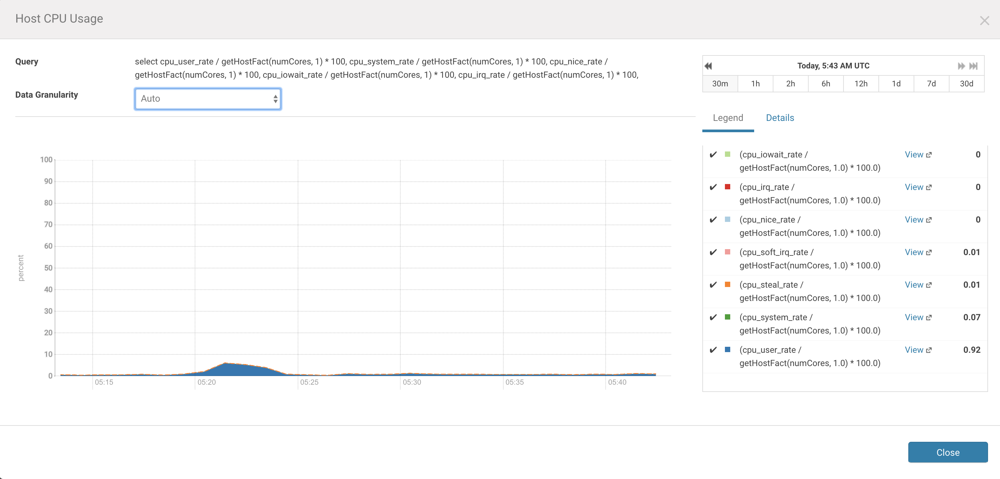

## 
 Challenge 7 - Cloudera Manager charts
* Create the Issue `Exit-test: CM chart`
  * Label it `started`
* Use Cloudera Manager to find a chart that will show the CPU utilization of the node where you have installed Cloudera Manager.
 
* Save it to `7_cmcpu.png`
