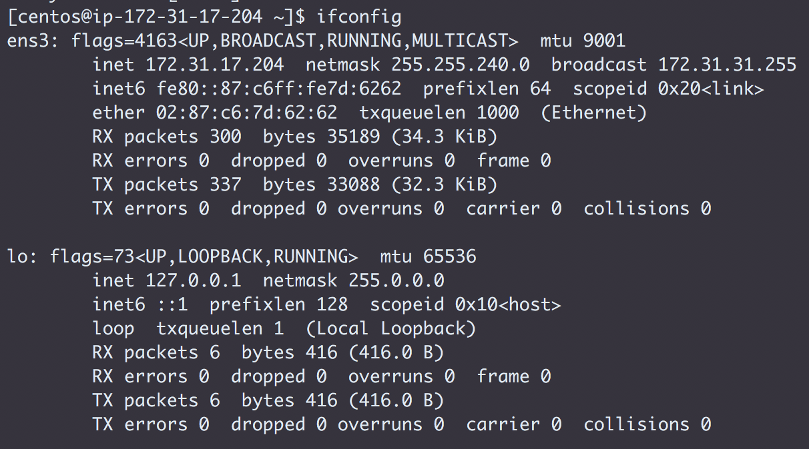

1. Setting up EC2
1. CM Installation
    1. Prerequisites
        1. System Check
            1. Setting vm.swappiness to **1**
            *Edit the following file to set the swappiness permanently*
            `sudo vi /etc/sysctl.conf`
            *Add the following line into the file that has been opened in the editor*
            `vm.swappiness = 1`
            *You need to restart the server after the config has been added to the file, after restart run the below command to check the swappiness*
            `cat /proc/sys/vm/swappiness`

            1. Mount attributes of volumes
            *Run the following command to get the mount attributes*
            `df -aT`

            **Node 1**
            

            **Node 2**
            

            **Node 3**
            

            **Node 4**
            

            **Node 5**
            

            1. Checking if files system is `ext`. No, file system is `xfs` so skipping to next step

            1. Disabling Huepage Support
            *Checking if Huepage support is enabled, before moving to disabling steps*
            `cat /sys/kernel/mm/transparent_hugepage/enabled`

            *To disable Huepage make the following changes*
            *First Step*
            `sudo vi /etc/grub.conf`
            *Add this line to the above file*
            `transparent_hugepage=never`
            *Second Step*
            `sudo vi /etc/rc.local`
            *Add this line to the above file*
            ```
            if test -f /sys/kernel/mm/transparent_hugepage/enabled; then
              echo never > /sys/kernel/mm/transparent_hugepage/enabled
            fi
            ```
            *Third Step [Did it as root user by running `sudo su`]*
            `echo never > /sys/kernel/mm/transparent_hugepage/enabled`

            1. Listing Network Configuration
            *Run the following command to list the network configuration*
            `ifconfig`

            **Node 1**
            

            **Node 2**
            

            **Node 3**
            

            **Node 4**
            

            **Node 5**
            

            1. Checking the forward and the reverse host lookup

            **Node 1 to Node 5**
            

            **Node 3 to Node 2**
            

            1. Check staus of nscd service  
            `sudo systemctl status nscd`  
            

            1. Check staus of ntp service  
            `sudo systemctl status ntpd`  
            

    1. MariaDB Installation
        1. Installed using `yum`
        `sudo yum install mariadb-server -y`

        1. Configured using the following
        `sudo /usr/bin/mysql_secure_installation`

        `sudo /usr/share/cmf/schema/scm_prepare_database.sh mysql -h localhost -uroot -pcdh1234 -P 3306 scm scm scm --force`
