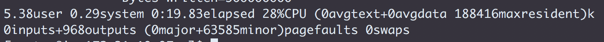
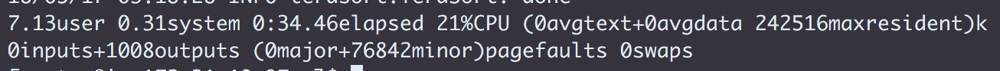

1. Teragen
  `sudo -u hdfs time hadoop jar /opt/cloudera/parcels/CDH-5.14.2-1.cdh5.14.2.p0.3/jars/hadoop-examples.jar teragen 5000000 /user/maruthiprithivi`

  

1. Terasort
  `sudo -u hdfs time hadoop jar /opt/cloudera/parcels/CDH-5.14.2-1.cdh5.14.2.p0.3/jars/hadoop-examples.jar terasort /user/maruthiprithivi /user/maruthiprithivi_done`
  
